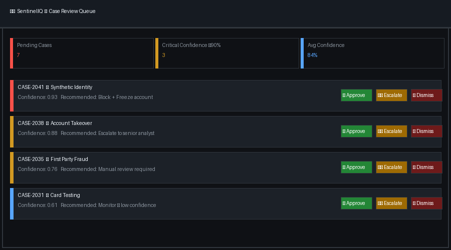
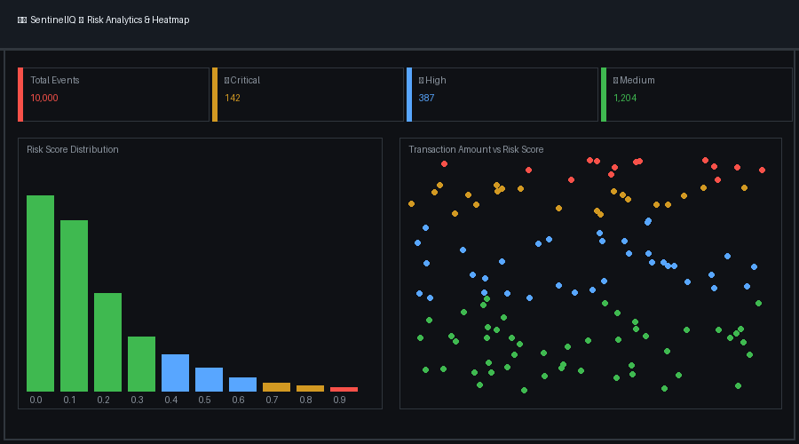
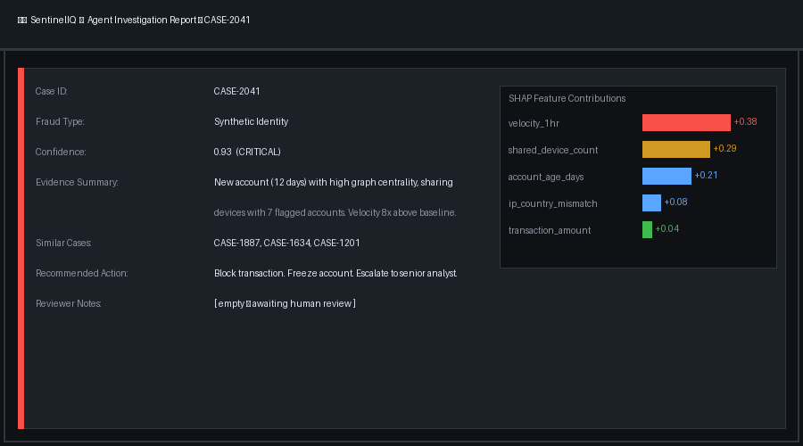
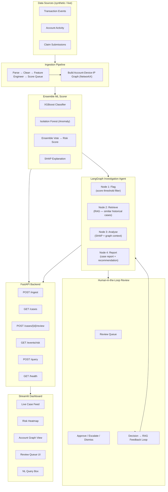

# SentinelIQ

**AI-powered fraud detection, case investigation, and human-in-the-loop review — built on local, on-premise AI via Ollama. No transaction data ever leaves your network.**

        

---

## Table of Contents

- [What It Does](#what-it-does)
- [Why Local AI?](#why-local-ai)
- [Screenshots](#screenshots)
- [Quick Start](#quick-start)
- [Architecture](#architecture)
- [Tech Stack](#tech-stack)
- [Project Structure](#project-structure)
- [Getting Started](#getting-started)
- [Core Modules](#core-modules)
- [Model Training](#model-training)
- [Deployment](#deployment)
- [Configuration](#configuration)
- [Troubleshooting](#troubleshooting)
- [Roadmap](#roadmap)
- [Business Value](#business-value)
- [Contributing](#contributing)
- [About](#about)
- [License](#license)

---

## What It Does

SentinelIQ is a multi-domain fraud detection and investigation platform that:

- **Flags** suspicious transactions, account events, and claims using an ensemble ML model (XGBoost + Isolation Forest)
- **Investigates** each flagged case automatically via a LangGraph agent — retrieving similar historical fraud patterns, analysing SHAP explanations, and cross-referencing account/device relationship graphs
- **Generates** structured case reports with a confidence score, evidence summary, fraud type classification, and recommended action
- **Presents** each case to a human reviewer via a review dashboard — approve, escalate, or dismiss with one click
- **Learns** from reviewer decisions — every outcome is logged back into the RAG knowledge base, making the system progressively smarter
- **Secures** your data through 100% local, on-premise AI inference via Ollama — no transaction or account data ever leaves your network

> Demo prompt: *"Flag all high-risk transactions from the last 24 hours, investigate the top 5 cases, and generate case reports for human review."*
> SentinelIQ scores every event, the agent investigates flagged cases, and a structured review queue appears on the dashboard — automatically.

---

## Why Local AI?

Financial and transactional data is among the most sensitive data an organisation holds. SentinelIQ is built on a local-first AI principle:

- 🔒 **No data leaves your network** — transaction details, account identifiers, and behavioural patterns stay internal
- ✅ **Compliance-friendly** — suitable for organisations under GDPR, PCI-DSS, or sector-specific data regulations
- 💸 **No per-token API costs** — inference runs locally at no marginal cost after setup
- 🚫 **No vendor lock-in** — swap the underlying model without changing application code

> For teams that prefer a hosted LLM, SentinelIQ supports a simple one-line swap — see [Cloud Deployment](#cloud-deployment-hosted-llm-variant).

---

## Screenshots

| Case Review Dashboard | Fraud Risk Heatmap | Agent Investigation Report |
|---|---|---|
|  |  |  |

> **Demo / Walkthrough:** [Insert Link to GIF or YouTube Video Tour Here]
> 
> No live demo hosted yet — see [Quick Start](#quick-start) to run locally in ~5 minutes.

---

## Quick Start

```bash
git clone https://github.com/rajan0860/sentineliq.git
cd sentineliq
pip install -r requirements.txt
cp .env.example .env                         # Add your config
python scripts/generate_data.py
python scripts/train_model.py
python scripts/ingest_and_run.py             # Ingest + embed + run agent
uvicorn src.api.main:app --port 8000         # Start backend API
streamlit run src/dashboard/app.py           # Launch dashboard
```

> **Note:** The `streamlit run` command must be run from the project root so that relative imports and data paths resolve correctly.

> See [Getting Started](#getting-started) for the full step-by-step walkthrough.

---

## Architecture



---

## Tech Stack

| Layer | Technology |
|---|---|
| Language | Python 3.10+ |
| RAG / Agents | LangChain, LangGraph |
| Vector store | ChromaDB |
| LLM | Ollama (qwen2.5:7b-instruct local) |
| ML scoring | XGBoost, Isolation Forest, scikit-learn, SHAP |
| Graph features | NetworkX |
| Data generation | Faker, pandas |
| Imbalanced ML | imbalanced-learn (SMOTE) |
| Backend API | FastAPI, Uvicorn |
| Frontend | Streamlit, Plotly |
| Deployment | Docker, Render, Hugging Face Spaces |
| Dev tools | python-dotenv, pydantic, schedule |

---

## Project Structure

```
sentineliq/
│
├── data/
│   ├── raw/                          # Raw ingested events
│   ├── processed/                    # Cleaned, feature-engineered data
│   ├── synthetic/                    # Generated transaction + account data
│   ├── graphs/                       # Serialised account-device-IP graphs
│   └── models/                       # Saved model artifacts
│
├── src/
│   ├── llm/
│   │   └── llm_client.py             # Ollama LLM + embedding abstraction
│   │
│   ├── ingestion/
│   │   ├── event_loader.py           # Transaction / account / claim ingestion
│   │   ├── graph_builder.py          # NetworkX graph construction
│   │   └── pipeline.py               # Unified ingestion pipeline
│   │
│   ├── rag/
│   │   ├── embeddings.py             # Embedding model setup
│   │   ├── vector_store.py           # ChromaDB setup + upsert
│   │   ├── retriever.py              # Retrieval chain + metadata filters
│   │   └── prompts.py                # System prompts + few-shot templates
│   │
│   ├── ml/
│   │   ├── feature_engineering.py    # Feature creation from event data
│   │   ├── graph_features.py         # Graph-derived features (degree, centrality)
│   │   ├── train.py                  # XGBoost + Isolation Forest training
│   │   ├── ensemble.py               # Ensemble scoring logic
│   │   ├── scorer.py                 # Inference + SHAP explanations
│   │   └── utils.py                  # SMOTE, class weighting, helpers
│   │
│   ├── agent/
│   │   ├── graph.py                  # LangGraph agent definition
│   │   ├── nodes.py                  # Flag / Retrieve / Analyse / Report nodes
│   │   ├── state.py                  # Agent state schema (Pydantic)
│   │   └── reports.py                # Case report formatting + output
│   │
│   ├── review/
│   │   ├── queue.py                  # Review queue management
│   │   ├── feedback.py               # Decision logging + RAG feedback loop
│   │   └── schemas.py                # Review decision models
│   │
│   ├── api/
│   │   ├── main.py                   # FastAPI app entry point
│   │   ├── routes/
│   │   │   ├── cases.py              # GET /cases, POST /cases/{id}/review
│   │   │   ├── events.py             # GET /events/risk
│   │   │   └── query.py              # POST /query (NL interface)
│   │   └── schemas.py                # Pydantic request/response models
│   │
│   └── dashboard/
│       ├── app.py                    # Streamlit entry point
│       ├── pages/
│       │   ├── live_feed.py          # Live flagged event feed
│       │   ├── risk_heatmap.py       # Risk heatmap by domain / time
│       │   ├── graph_view.py         # Account-device-IP graph visualisation
│       │   ├── review_queue.py       # Human review UI
│       │   └── query.py              # Natural language query view
│       └── components/               # Reusable UI components
│
├── scripts/
│   ├── generate_data.py              # Synthetic data generation (Faker)
│   ├── ingest_and_run.py             # Manual trigger for ingestion + agent
│   └── train_model.py                # One-shot model training script
│
├── tests/
│   ├── test_rag.py
│   ├── test_scorer.py
│   ├── test_agent.py
│   └── test_review.py
│
├── notebooks/
│   ├── 01_rag_exploration.ipynb      # RAG pipeline experiments
│   ├── 02_ensemble_training.ipynb    # Model training walkthrough
│   └── 03_graph_features.ipynb       # Graph feature engineering
│
├── Dockerfile
├── docker-compose.yml
├── requirements.txt
├── .env.example
└── README.md
```

---

## Getting Started

### Prerequisites

- Python 3.10+
- [Ollama](https://ollama.com) installed locally (free, runs on your machine)
- **Minimum hardware:** 8GB+ RAM recommended (~5-6GB VRAM is best for `qwen2.5:7b-instruct`). Apple Silicon Macs or dedicated GPUs perform best. 
> *Tip: If you have constrained hardware, you can update `.env` to use a smaller model like `phi3:mini`.*

### 1. Clone the repository

```bash
git clone https://github.com/rajan0860/sentineliq.git
cd sentineliq
```

### 2. Create virtual environment

```bash
python -m venv venv
source venv/bin/activate        # Mac/Linux
venv\Scripts\activate           # Windows
```

### 3. Install dependencies

```bash
pip install -r requirements.txt
```

### 4. Pull Ollama models

```bash
brew install ollama              # macOS (or download from https://ollama.com)
ollama pull qwen2.5:7b-instruct  # LLM (~4.7 GB)
ollama pull nomic-embed-text     # Embeddings (~274 MB)
```

### 5. Configure environment variables

```bash
cp .env.example .env
```

Edit `.env` with your preferred settings (see [Configuration](#configuration)). No LLM API key needed — Ollama runs locally.

### 6. Generate synthetic data

```bash
python scripts/generate_data.py
```

Creates 10,000 synthetic transaction/account/claim events with a realistic 1.5% fraud rate, plus 200 historical fraud case documents in `data/synthetic/`.

### 7. Train the ensemble model

```bash
python scripts/train_model.py
```

Trains XGBoost and Isolation Forest, applies SMOTE for class imbalance, and saves artifacts to `data/models/`.

### 8. Run the ingestion pipeline

```bash
python scripts/ingest_and_run.py
```

Ingests events, builds the account graph, embeds historical cases into ChromaDB, and runs the agent on flagged events.

### 9. Start the backend API

```bash
uvicorn src.api.main:app --reload --port 8000
```

API docs: [http://localhost:8000/docs](http://localhost:8000/docs)

### 10. Launch the Streamlit dashboard

```bash
streamlit run src/dashboard/app.py
```

Dashboard: [http://localhost:8501](http://localhost:8501)

---

## Core Modules

### Ensemble ML Scorer

Combines XGBoost (supervised classification) and Isolation Forest (unsupervised anomaly detection) for robust fraud flagging. SMOTE handles the severe class imbalance typical of real fraud datasets.

```python
from src.ml.ensemble import EnsembleScorer

scorer = EnsembleScorer(
    xgb_path="data/models/xgboost_fraud.json",
    iso_path="data/models/isolation_forest.pkl"
)

result = scorer.score({
    "transaction_amount": 4850.00,
    "account_age_days": 12,
    "device_change_count": 3,
    "ip_country_mismatch": 1,
    "velocity_1hr": 8,
    "graph_degree_centrality": 0.91,
    "avg_txn_amount_30d": 320.00,
    "failed_login_count_24hr": 4,
})
# {
#   "risk_score": 0.93,
#   "risk_level": "CRITICAL",
#   "flags": ["xgboost_high", "isolation_forest_anomaly"],
#   "explanation": "Unusual velocity (+0.38), new account with high graph centrality (+0.29)"
# }
```

### Graph Feature Engineering

Models relationships between accounts, devices, and IP addresses as a graph. Derived features (degree centrality, connected component size, shared device count) significantly improve model performance on synthetic-identity and account-takeover patterns.

```python
from src.ml.graph_features import GraphFeatureExtractor

extractor = GraphFeatureExtractor("data/graphs/account_graph.pkl")

features = extractor.extract(account_id="ACC-00412")
# {
#   "degree_centrality": 0.91,
#   "shared_devices": 7,
#   "connected_accounts": 14,
#   "ip_reuse_count": 3
# }
```

### LangGraph Investigation Agent

A four-node agent that moves from flagging through to a structured case report with recommended action.

```python
from src.agent.graph import InvestigationAgent

agent = InvestigationAgent()
report = agent.investigate(case_id="CASE-2041")

# {
#   "case_id": "CASE-2041",
#   "fraud_type": "Synthetic Identity",
#   "confidence": 0.91,
#   "evidence_summary": "New account (12 days old) with unusually high graph centrality,
#                        sharing devices with 7 flagged accounts. Transaction velocity 8x
#                        above account baseline in past hour.",
#   "similar_cases": ["CASE-1887", "CASE-1634"],
#   "recommended_action": "Block transaction. Freeze account pending manual review.
#                          Escalate to senior analyst.",
#   "reviewer_notes": ""
# }
```

### Human-in-the-Loop Review & Feedback Loop

Reviewer decisions are logged and fed back into the RAG knowledge base — making future investigations more accurate over time.

```python
from src.review.feedback import ReviewFeedbackHandler

handler = ReviewFeedbackHandler()

handler.log_decision(
    case_id="CASE-2041",
    decision="escalate",
    reviewer_notes="Confirmed synthetic identity ring — linked to 3 other open cases",
    outcome_label="confirmed_fraud"
)
# Decision stored → ChromaDB updated → future similar cases retrieve this outcome
```

### FastAPI Endpoints

| Method | Endpoint | Description |
|---|---|---|
| `GET` | `/health` | System health check |
| `POST` | `/ingest` | Trigger manual ingestion + scoring run |
| `GET` | `/cases` | Get all open investigation cases |
| `GET` | `/cases/{id}` | Get full case report |
| `POST` | `/cases/{id}/review` | Submit reviewer decision |
| `GET` | `/events/risk` | Get all events ranked by risk score |
| `GET` | `/events/{id}` | Get risk detail for a single event |
| `POST` | `/query` | Natural language query over RAG |

**Example request:**

```bash
curl -X POST http://localhost:8000/cases/CASE-2041/review \
  -H "Content-Type: application/json" \
  -d '{"decision": "escalate", "reviewer_notes": "Confirmed fraud ring"}'
```

---

## Model Training

The ensemble model is trained on engineered features from synthetic transaction, account, and claim data.

**Features:**

| Feature | Description |
|---|---|
| `transaction_amount` | Value of the transaction |
| `account_age_days` | Days since account creation |
| `device_change_count` | Number of device changes in past 30 days |
| `ip_country_mismatch` | Whether IP country differs from account country |
| `velocity_1hr` | Number of transactions in past hour |
| `graph_degree_centrality` | Account's centrality in account-device-IP graph |
| `avg_txn_amount_30d` | Average transaction amount over past 30 days |
| `failed_login_count_24hr` | Failed login attempts in past 24 hours |

**Train the model:**

```bash
python scripts/train_model.py --data data/synthetic/events.csv --output data/models/
```

**Expected output:**

```
Applying SMOTE for class imbalance (fraud rate: 1.5%)...
Training XGBoost classifier...
Training Isolation Forest...

XGBoost Results:
  Train AUC:   0.971
  Val AUC:     0.934
  Precision:   0.87
  Recall:      0.83
  F1:          0.85

Isolation Forest Results:
  Contamination: 0.015
  Anomaly detection rate: 0.79

Ensemble (vote):
  Combined AUC: 0.941
  Models saved to data/models/
```

**Data generation:**

```bash
python scripts/generate_data.py --events 10000 --fraud-rate 0.015 --output data/synthetic/
```

---

## Deployment

### Docker (local)

```bash
docker-compose up --build
```

Services started:
- **FastAPI backend:** `http://localhost:8000`
- **Streamlit dashboard:** `http://localhost:8501`
- **ChromaDB:** persistent volume at `./data/chroma`

---

### Cloud Deployment (hosted LLM variant)

> [!WARNING]
> Because SentinelIQ relies on a 4.7GB local LLM (`qwen2.5:7b-instruct`) via Ollama, it cannot be run on the free tiers of Render or Hugging Face Spaces (which typically provide 1–2GB RAM).
>
> **Option 1:** Deploy to a VPS with at least 8GB RAM (e.g. Hetzner CPX31 or equivalent).
>
> **Option 2:** Swap Ollama for a hosted LLM provider by updating `llm_client.py`:

```python
# Replace OllamaLLM with any LangChain-compatible provider
from langchain_anthropic import ChatAnthropic
llm = ChatAnthropic(model="claude-haiku-4-5")

# Or OpenAI
from langchain_openai import ChatOpenAI
llm = ChatOpenAI(model="gpt-4o-mini")
```

> Once updated, FastAPI + Streamlit services deploy to Render or Railway on their free tiers without a GPU.

---

## Configuration

All configuration is via environment variables. Copy `.env.example` to `.env` before running.

```env
# LLM (Ollama — local, no API key needed)
OLLAMA_BASE_URL=http://localhost:11434
OLLAMA_MODEL=qwen2.5:7b-instruct
OLLAMA_EMBED_MODEL=nomic-embed-text

# Vector store
CHROMA_PERSIST_DIR=./data/chroma
CHROMA_COLLECTION_NAME=fraud_cases

# Model
XGB_MODEL_PATH=./data/models/xgboost_fraud.json
ISO_MODEL_PATH=./data/models/isolation_forest.pkl
GRAPH_PATH=./data/graphs/account_graph.pkl

# Scoring thresholds
RISK_THRESHOLD_HIGH=0.75
RISK_THRESHOLD_CRITICAL=0.90

# Agent scheduling (minutes — fraud runs more frequently than supply chain)
AGENT_RUN_INTERVAL=15

# API
API_HOST=0.0.0.0
API_PORT=8000
```

---

## Troubleshooting

| Problem | Solution |
|---|---|
| `ChromaDB` errors on startup | Ensure `CHROMA_PERSIST_DIR` points to a writable directory. Delete `data/chroma/` to reset. |
| Ollama connection refused | Make sure Ollama is running (`ollama serve`). Check with `curl http://localhost:11434/api/tags`. |
| Model not found | Pull required models: `ollama pull qwen2.5:7b-instruct` and `ollama pull nomic-embed-text`. |
| Low recall on fraud class | Increase SMOTE ratio in `train.py` or lower `RISK_THRESHOLD_HIGH` in `.env`. |
| Graph build is slow | Reduce synthetic event count or increase `--chunk-size` in `graph_builder.py`. |
| Streamlit won't connect to API | Ensure FastAPI backend is running on port 8000 before launching the dashboard. |
| `ModuleNotFoundError` | Activate your virtual environment and run `pip install -r requirements.txt`. |

---

## Testing

```bash
pytest tests/
```

Covers the RAG pipeline, ensemble scorer, LangGraph agent, and review feedback loop.

---

## Roadmap

- [x] Ensemble ML scoring (XGBoost + Isolation Forest)
- [x] LangGraph investigation agent
- [x] RAG over historical fraud cases
- [x] Human-in-the-loop review dashboard
- [x] FastAPI backend
- [x] Streamlit dashboard
- [x] Graph feature engineering (NetworkX)
- [x] SMOTE for class imbalance
- [x] SHAP explanations per case
- [x] Reviewer feedback loop into RAG
- [ ] Real-time streaming ingestion (Kafka)
- [ ] Fine-tuned embedding model for fraud domain
- [ ] Multi-reviewer workflow with role-based access
- [ ] Webhook integration with payment processors
- [ ] Historical backtesting dashboard
- [ ] Email / Slack escalation notifications

---

## Business Value

SentinelIQ addresses four core challenges in fraud operations:

🚨 **High false-positive rates** — the ensemble model combines supervised and unsupervised signals, reducing false positives that waste analyst time compared to threshold-only rules engines.

🔍 **Slow manual investigation** — the LangGraph agent compresses a multi-step investigation (pattern lookup, evidence gathering, recommendation) from hours to seconds, letting analysts focus on decisions rather than research.

📈 **Static detection that doesn't learn** — the reviewer feedback loop continuously enriches the RAG knowledge base with confirmed outcomes, so the system improves with every case closed.

🔒 **Data security and compliance** — fully local AI inference means sensitive transaction and account data never touches a third-party API, supporting GDPR, PCI-DSS, and internal data governance requirements.

> *Indicative ROI: Reducing analyst investigation time per case from 45 minutes to 10 minutes across 200 monthly cases frees roughly 116 analyst-hours per month — equivalent to a meaningful portion of a full-time analyst's capacity.*

---

## Part of the IQ Portfolio

SentinelIQ is the second project in a suite of AI-powered operational intelligence tools:

| Project | Domain | Focus |
|---|---|---|
| [FreightIQ](https://github.com/rajan0860/freightiq) | Logistics | Supply chain disruption detection + shipment risk scoring |
| **SentinelIQ** | Finance / Multi-domain | Fraud detection + agentic case investigation |

Each project shares a common engineering philosophy: local AI inference, RAG-powered context retrieval, agentic orchestration, and full-stack delivery.

---

## Contributing

Contributions are welcome! Please:

1. **Open an issue** to discuss your proposed change before starting work
2. **Fork the repo** and create a feature branch (`feature/your-feature-name`)
3. **Follow existing code style** — use type hints, docstrings, and keep modules focused. (Standard tools like `black` and `flake8/ruff` are recommended).
4. **Add or update tests** for any new functionality in `tests/`. Mock LLM calls if needed to avoid requiring local Ollama for basic test runs.
5. **Submit a pull request** with a clear description of what changed and why

---

## About

Built by **Rajan Mehta** as a portfolio project demonstrating end-to-end AI engineering across ensemble ML, graph feature engineering, agentic investigation, and human-in-the-loop review systems.

**Skills demonstrated:** LangChain · LangGraph · ChromaDB · XGBoost · Isolation Forest · NetworkX · SHAP · SMOTE · FastAPI · Streamlit · Python · Docker · Prompt engineering · Graph ML

🔗 [Portfolio](https://your-portfolio.com) · [LinkedIn](https://linkedin.com/in/rajan-mehta)

---

## Version

`v1.0.0` — Initial release with ensemble ML scoring, graph features, LangGraph investigation agent, human-in-the-loop review, RAG feedback loop, FastAPI backend, and Streamlit dashboard.

---

## Disclaimer

**Educational Purpose Only.** This project and its architecture are intended for educational and demonstrative purposes. The default configuration uses synthetic data. Before deploying any system to process real transactional data or Personally Identifiable Information (PII) in an enterprise environment, ensure you conduct thorough security, compliance, and legal audits (e.g., GDPR, PCI-DSS).

---

## License

MIT License — free to use, adapt, and build on.

---

⭐ **If you found this project useful or interesting, please consider starring the repo — it helps with visibility and motivates continued development!**